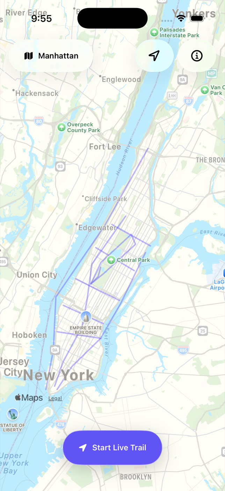
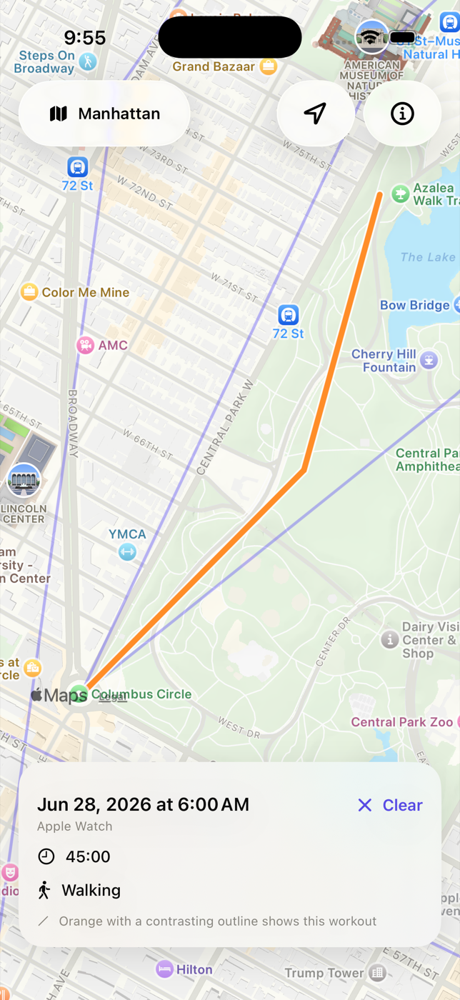
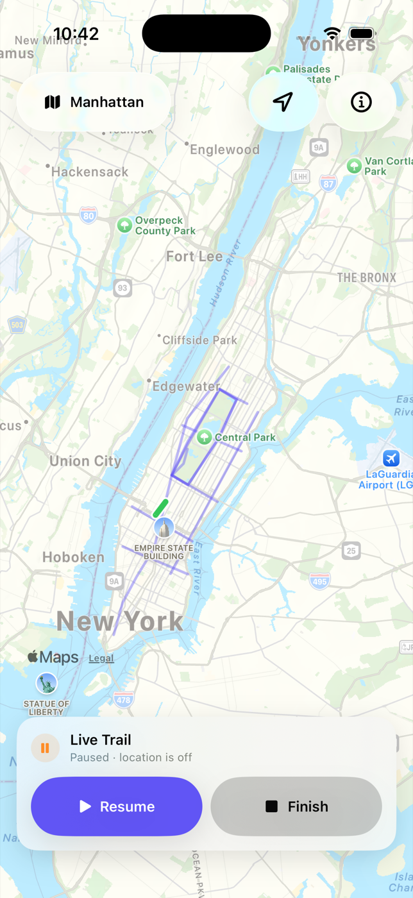

<p align="center">
  
</p>

<h1 align="center">Walk It All</h1>

<p align="center">
  <strong>See what you’ve covered. Walk it all.</strong><br>
  A private iPhone map of everywhere your recorded outdoor workouts have taken you.
</p>

<p align="center">
  <a href="https://github.com/arminnajafi/walk-it-all/actions/workflows/verify-ios.yml"></a>
</p>

Walk It All combines walking, hiking, running, and cycling routes from Apple Health into one calm lifetime map. It opens on Manhattan, works with recorded routes anywhere in the world, and keeps route processing on your iPhone.

## What it looks like

<table>
  <tr>
    <td align="center"><strong>Lifetime map</strong></td>
    <td align="center"><strong>Workout details</strong></td>
    <td align="center"><strong>Live Trail</strong></td>
  </tr>
  <tr>
    <td></td>
    <td></td>
    <td></td>
  </tr>
</table>

<sub>Screenshots show demo routes.</sub>

## The idea

Apple Fitness is good at showing one workout at a time. Walk It All answers a different question: **where have all of my recorded outdoor workouts taken me?**

- Permanent routes come from read-only Apple Health access.
- Walking, hiking, running, and cycling appear together in indigo.
- Selecting a workout highlights it in orange and shows its activity, source, date, and duration.
- **Live Trail** draws one temporary green trail while you explore. It can continue through screen lock, but remains independent of Apple Health and stays only until you clear or replace it.
- The map starts on Manhattan, including parks and waterfront paths, but imported routes can appear anywhere.

This is a route-history map—not a claim that every street, block, or sidewalk has been completed. Ordinary steps and indoor workouts do not contain GPS routes and therefore do not appear.

## Private by design

- No account, backend, analytics, advertising, or route upload
- No passive or all-day location tracking
- Health routes are simplified and cached locally in protected, backup-excluded storage
- Full-resolution Health locations are discarded after processing
- Apple Health remains the recoverable source of truth after reinstalling or changing phones, provided that route history is available there
- Background location runs only during a Live Trail the user explicitly starts

See [Privacy and recovery](Documentation/PRIVACY.md) for the complete data-handling model.

## Health refresh behavior

Walk It All checks Apple Health when the app launches, returns to the foreground, and every five minutes while it remains active. **Refresh from Apple Health** runs an immediate incremental check; **Rebuild full history** reconstructs the local map from readable Health history.

Recent workouts are safely rechecked because Apple Health may deliver or replace their routes later. The app reports only routes that actually changed, so an unchanged refresh says **Apple Health is up to date**.

## Availability

Walk It All is not yet available on the App Store. You can build it from source on a Mac and install it on your own iPhone with Xcode.

## Install with Codex or Claude Code

An AI coding agent can guide most of the installation. Apple still requires you to sign in to Xcode with your own Apple Account, trust the Mac from your iPhone, enable Developer Mode, and approve the app's permissions.

A free Xcode Personal Team can sign the app for personal use. Apple currently allows up to 10 App IDs, 3 test devices per platform, and 3 apps per device; these registrations and the provisioning profile expire after 7 days. The limits apply separately to each Apple Account. See Apple’s [Personal Team limits](https://developer.apple.com/help/account/basics/about-your-developer-account).

<details>
<summary><strong>Copy this prompt into Codex or Claude Code</strong></summary>

```text
Help me install Walk It All on my own iPhone for personal use.

Repository: https://github.com/arminnajafi/walk-it-all

Please:
1. Clone the repository into a sensible local Projects folder and read its README before changing anything.
2. Confirm that the current full Xcode and XcodeGen are installed. Install only XcodeGen if needed; do not install or download a different Xcode or iOS runtime without asking me.
3. Explain the manual Apple steps when they become necessary: signing in to Xcode with my Apple Account, choosing my Personal Team, connecting and trusting my iPhone, and enabling Developer Mode.
4. Do not use the repository owner’s signing team or bundle identifier. Ask me for a unique reverse-DNS bundle identifier, then update DEVELOPMENT_TEAM and PRODUCT_BUNDLE_IDENTIFIER only in my local clone. Keep the same values for later reinstalls so updates preserve the app’s local data.
5. Regenerate the Xcode project, run ./Scripts/verify.sh, and resolve any build issue without weakening privacy or removing tests.
6. Build, sign, install, and launch the app on my iPhone using supported Xcode device tooling and automatic signing. Do not erase or uninstall an existing Walk It All app unless I explicitly approve it.
7. Guide me through read-only Apple Health access and optional When-In-Use location access. Never export, upload, print, or commit Health routes, coordinates, device identifiers, or signing credentials.
8. Tell me clearly if a step must be completed by me on the Mac or iPhone. Do not claim success until the app launches on the phone.

This app is not on the App Store or TestFlight. If I use a free Personal Team, remind me that its provisioning expires after 7 days and that I will need to rebuild and reinstall with the same team and bundle identifier.
```

</details>

## Build and verify

Requirements:

- A Mac with the current full Xcode installation
- [XcodeGen](https://github.com/yonaskolb/XcodeGen)
- An iPhone running iOS 17 or later for representative Apple Health testing

```sh
brew install xcodegen
xcodegen generate
./Scripts/verify.sh
open WalkItAll.xcodeproj
```

In Xcode, select your development team for the app and test targets, then run on an iPhone. The Simulator can exercise the interface and automated tests, but does not represent real Health route access.

## Architecture at a glance

- SwiftUI interface with a narrow `MKMapView` bridge
- HealthKit workout and mutable-route synchronization
- SwiftData protected local projection rebuilt from Apple Health
- Pure-Swift route filtering and simplification in `WalkItAllCore`
- Core Location background delivery only for an explicitly active Live Trail
- Swift 6 strict concurrency and no third-party runtime SDKs

## Repository guide

- `WalkItAll/` — app, HealthKit adapter, protected persistence, map renderer, and SwiftUI views
- `Packages/WalkItAllCore/` — portable route filtering, simplification, and Live Trail processing
- `WalkItAllTests/` and `WalkItAllUITests/` — behavior, persistence, map, and interface coverage
- `Documentation/` — product, architecture, privacy, and validation decisions
- `LocalRouteFixtures/` — ignored private device evidence; its contents must never be committed

## Documentation

- [Product direction](Documentation/PRODUCT.md)
- [Architecture](Documentation/ARCHITECTURE.md)
- [Privacy and recovery](Documentation/PRIVACY.md)
- [Validation and release gates](Documentation/VALIDATION.md)
- [Why the product became a lifetime route map](Documentation/DECISION-ROUTE-HISTORY.md)

## License

No open-source license has been selected yet. The source is publicly viewable, but no permission to copy, modify, or redistribute it is granted by default.
